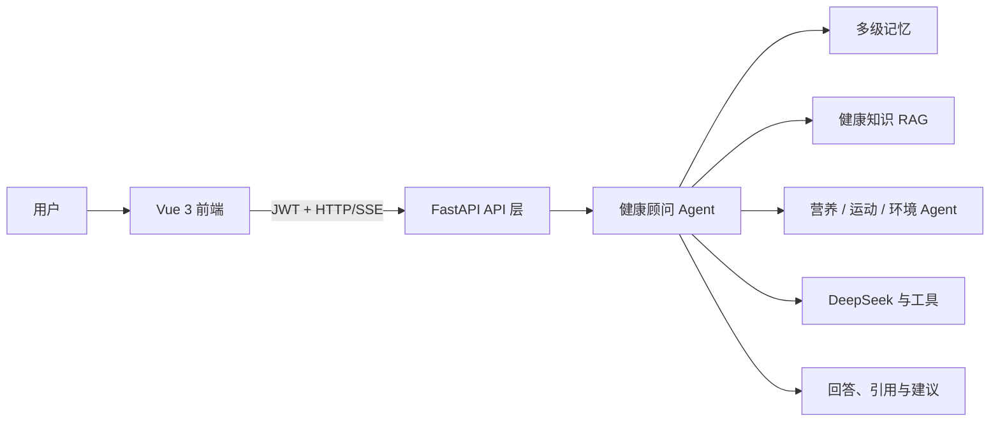
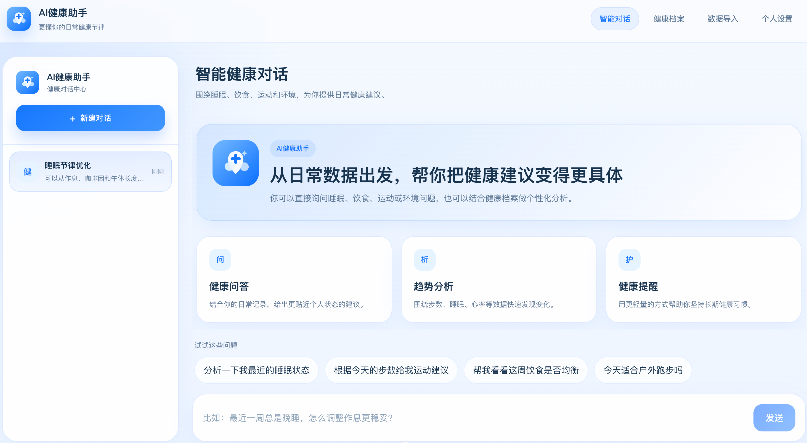

# HealthAI — 多 Agent 智能健康管理助手

<p align="center">
  
</p>
<p align="center">
  <strong>由 LangGraph 搭建多 Agent 智能健康管理助手，提供编排、状态管理与运行时调度能力</strong><br />
  把健康对话、营养分析、运动规划、环境健康、健康档案、多级记忆与 RAG 知识检索组织在同一个可观测工作台。
</p>


> 项目中的 AI 输出仅供健康生活方式参考，不构成诊断或治疗建议。如有身体不适，请咨询专业医生。

## 产品定位

HealthAI 不是一个只展示健康知识或聊天记录的对话框。它以用户健康档案和数据为上下文，通过 LangGraph 状态机驱动健康顾问 Agent 做安全检查、意图理解、任务规划与结果聚合，再把营养、运动、环境等任务交给专项 Agent，或从 RAG 知识库补充可引用的健康指南。

## 功能特性

- **AI 健康对话与健康顾问**：基于用户画像、会话记忆和健康数据生成综合建议。
- **专项 Agent 协同**：内置营养分析、运动规划、环境感知 Agent，可由主 Agent 编排调用。
- **个人健康档案**：支持注册登录、资料维护、健康数据查看和统计图表。
- **健康数据导入**：支持心率、睡眠、步数等 CSV/JSON 数据导入。
- **RAG 知识增强**：支持 Markdown、PDF 等健康指南导入，检索结果可参与回答。
- **多级记忆系统**：短期会话、中期上下文与长期记忆协作，提升连续对话体验。
- **安全与可观测性**：JWT 认证、请求限流、请求尺寸保护、Trace ID 与工具调用追踪。

## 工作原理



完整架构、请求链路、数据边界和设计取舍见 [`docs/ARCHITECTURE.md`](docs/ARCHITECTURE.md)。

## 界面预览



## 项目结构

```text
backend/      FastAPI 后端、Agent 编排、数据库模型与 API
frontend/     Vue 3 + TypeScript + Element Plus 前端
docs/         架构与项目文档
datas/        心率、睡眠、步数示例数据
rag_docs/     RAG 检索示例文档
scripts/      跨平台本地开发与 Docker 启动脚本
pics/         README 与文档使用图片
```

## 快速开始

### 1. 一键启动（推荐）

在仓库根目录执行：

```bash
npm run dev
```

脚本会自动完成以下工作：

- 创建 `backend/.env` 和 `frontend/.env`（如果不存在）。
- 创建后端虚拟环境并安装依赖。
- 安装前端依赖。
- 同时启动后端和前端。

启动后访问：

- 前端：<http://localhost:5173>
- API 文档：<http://localhost:8000/docs>
- 健康检查：<http://localhost:8000/api/v1/health>

常用选项：

```bash
# 只启动后端
npm run dev -- --backend-only

# 只启动前端
npm run dev -- --frontend-only

# 复用已安装依赖，避免重复安装
npm run dev -- --skip-install
```

### 2. Docker Compose 一键启动

在仓库根目录执行：

```bash
npm run docker:up
```

该命令会复用 Docker Compose 构建并启动前端、后端、PostgreSQL、Redis 和 Elasticsearch。如果 `backend/.env` 不存在，会先从样例文件创建。

启动后访问：

- 前端：<http://localhost:5173>
- API 文档：<http://localhost:8000/docs>

停止服务：

```bash
npm run docker:down
```

### 3. 手动启动后端

```bash
cd backend
python -m venv .venv

# Windows PowerShell
.\.venv\Scripts\Activate.ps1

# macOS / Linux
# source .venv/bin/activate

pip install -r requirements.txt
Copy-Item .env.sample .env   # Windows PowerShell
# cp .env.sample .env        # macOS / Linux
uvicorn app.main:app --reload --host 0.0.0.0 --port 8000
```

后端启动后访问：

- API 文档：<http://localhost:8000/docs>
- 健康检查：<http://localhost:8000/api/v1/health>

本地开发默认使用 SQLite；`backend/.env.sample` 中的短期记忆指向 Redis。本地没有 Redis 时，可把 `SHORT_TERM_BACKEND=memory` 改为进程内记忆。生产环境建议配置 PostgreSQL、Redis 和 Elasticsearch。

### 4. 手动启动前端

```bash
cd frontend
npm install
Copy-Item .env.sample .env   # Windows PowerShell
# cp .env.sample .env        # macOS / Linux
npm run dev
```

前端地址：<http://localhost:5173>

## 构建与部署

单机生产部署推荐使用 Docker Compose：

```bash
docker compose build backend frontend
docker compose up -d backend frontend
```

前端静态资源打包：

```bash
npm --prefix frontend run build
```

完整的生产配置、裸机部署、镜像打包、检查清单和故障排查见 [`docs/DEPLOYMENT.md`](docs/DEPLOYMENT.md)。

## 数据导入

登录后可以在前端“数据导入”页面上传 `datas/` 中的示例文件。

| 数据类型 | CSV 示例 | JSON 示例 |
| --- | --- | --- |
| 步数 | `datas/steps_data.csv` | `datas/steps_data.json` |
| 睡眠 | `datas/sleep_data.csv` | `datas/sleep_data.json` |
| 心率 | `datas/heart_rate_data.csv` | `datas/heart_rate_data.json` |

对应字段示例：

```csv
date,steps,distance,calories
2026-04-19,8234,5.8,328
```

## RAG 知识库导入

RAG 导入依赖 Elasticsearch 和 DashScope Embedding API。请先在 `backend/.env` 中配置：

```env
DASHSCOPE_API_KEY=your-api-key
ELASTICSEARCH_URL=http://localhost:9200
```

使用后端脚本导入 `rag_docs/`：

```bash
cd backend
python -m scripts.import_knowledge --input ../rag_docs --recursive --category health
```

常用参数：

```bash
python -m scripts.import_knowledge --help
```

## 运行测试

```bash
cd backend
python -m pytest
```

前端类型检查与构建：

```bash
cd frontend
npm run type-check
npm run build
```

## 环境变量

仓库中提供不含敏感信息的样例文件：

- `backend/.env.sample`
- `frontend/.env.sample`

真实 `.env` 文件不应提交到 Git。部署前请替换 `JWT_SECRET_KEY`，并只填入你自己的 API Key。

## 技术栈

| 层级 | 技术 |
| --- | --- |
| 前端 | Vue 3、TypeScript、Vite、Element Plus、ECharts |
| 后端 | Python、FastAPI、SQLAlchemy、LangGraph、Celery（预留） |
| 数据存储 | SQLite / PostgreSQL、Redis、Elasticsearch |
| AI 能力 | DeepSeek、DashScope Embedding、RAG |

## License

本项目基于 [MIT License](LICENSE) 开源。

