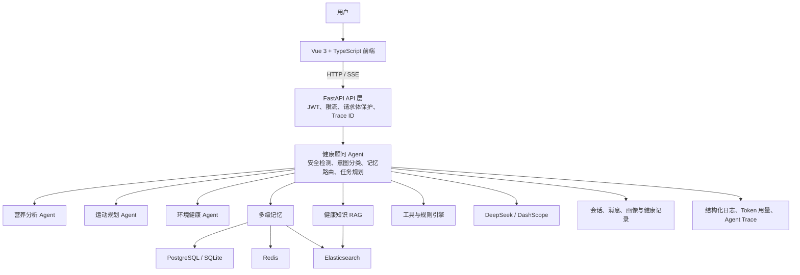

# HealthAI 架构与工作原理

本文说明 HealthAI 的运行链路、Agent 编排、记忆与 RAG 设计、安全边界和当前能力边界。项目细节以当前代码为准。

## 系统总览

## 运行时分层

| 层级 | 职责 | 关键实现 |
| --- | --- | --- |
| 交互层 | 登录注册、健康对话、健康档案、数据导入、知识导入和图表展示 | Vue 3、TypeScript、Vite、Pinia、Element Plus、ECharts、Marked |
| API 层 | 认证、会话管理、请求防护、路由转发和 SSE 输出 | FastAPI、Pydantic、依赖注入 |
| 编排层 | 理解用户意图、判断紧急风险、组织上下文和调度子任务 | Health Advisor Agent、LangGraph 状态定义、DAG 编排器 |
| 专业能力层 | 执行营养分析、运动规划、环境健康查询和专项 LLM 精炼 | Nutrition Agent、Exercise Agent、Environment Agent |
| 知识与记忆层 | 组装用户画像、会话上下文、历史偏好和健康指南 | PostgreSQL/SQLite、Redis、Elasticsearch、DashScope Embedding |
| 模型与工具层 | 提供自然语言生成、嵌入、营养查询、运动与天气空气质量查询 | DeepSeek、LangChain 适配器、DashScope、规则引擎 |
| 可观测层 | 注入 Trace ID、记录阶段耗时、结构化日志和 Token 用量 | `core/observability.py`、`core/http_guard.py`、`llm/usage.py` |

## 核心请求链路

Health Advisor 的 LangGraph 拓扑定义了标准处理流程。当前聊天 API 为了让每个阶段都可测试和可观测，`POST /api/v1/chat/send` 与 `POST /api/v1/chat/stream` 共享 `_process_state`，按相同阶段顺序显式执行：

1. **认证与会话创建**：请求先经过 JWT 认证，再定位或创建当前用户的 `ChatSession`。
2. **加载上下文**：读取用户画像、健康数据、短期会话、中期摘要，并在必要时从数据库回填短期记忆。
3. **安全检测**：识别紧急健康风险。命中紧急场景时直接返回引导就医的安全回复，不再执行普通生成链路。
4. **意图分类与记忆路由**：判断用户是否关心营养、运动、环境或综合问题，并决定需要短期、长期记忆或 RAG。
5. **记忆检索**：按路由结果读取 Redis 短期会话、PostgreSQL 中期摘要和 Elasticsearch 长期记忆。
6. **任务规划**：把复杂问题拆成带依赖关系的子任务；简单问题可以直接进入 RAG 或 LLM 生成。
7. **DAG 调度**：`AgentOrchestrator` 按依赖分批并行执行子任务，处理超时、重试、失败和依赖缺失。
8. **结果聚合**：把专项 Agent 的结构化结果合并为统一上下文。
9. **RAG 检索**：需要知识支撑时执行 Elasticsearch BM25 与稠密向量混合检索，并生成引用。
10. **回复生成**：`ContextAssembler` 按预算组装画像、记忆、Agent 结果和 RAG 段落，再调用 DeepSeek 生成最终回答。
11. **后处理与持久化**：生成建议问题、提取画像更新、写入长期记忆，并保存用户与助手消息、引用，随后更新短期与中期记忆。

SSE 接口在完整链路执行完成后，按小块推送生成结果、安全标记、引用和建议问题。它提供前端打字机体验，不是逐 token 的模型流式转发。

## Agent 编排

### 健康顾问 Agent

健康顾问 Agent 是中央协调器，负责上下文、风险、意图、记忆、任务规划和结果聚合。其状态包含用户消息、用户 ID、会话 ID、画像、记忆、子任务、Agent 结果、RAG 文档、引用、Trace 和安全标记。

LangGraph 图中的主要节点包括：

- `load_context`：加载画像、健康数据与短期/中期记忆。
- `check_safety` / `urgent_reply`：识别紧急风险并提供安全回复。
- `classify_intent`：识别健康领域和用户意图。
- `memory_route` / `retrieve_memory`：决定并执行记忆读取。
- `plan_tasks`：规划是否需要专项 Agent、RAG 或直接生成。
- `dispatch_agents` / `aggregate_results`：执行 DAG 调度并聚合结果。
- `rag_retrieve`：检索健康知识并产出引用。
- `generate_response`：组装上下文并生成回答。
- `post_process`：做收尾处理和状态整理。

### 专业 Agent

| Agent | 主要职责 | 当前实现 |
| --- | --- | --- |
| 营养分析 Agent | 提取食物、查询营养数据、分析膳食并生成建议 | 工具与规则基线，支持 LLM 精炼相关流程 |
| 运动规划 Agent | 评估体能、生成运动计划、检查运动风险 | 工具与规则基线，`EXERCISE_LLM_REFINE_ENABLED` 默认关闭 |
| 环境健康 Agent | 解析位置、查询天气与空气质量、评估环境风险 | 工具与规则基线，`ENVIRONMENT_LLM_ADVICE_ENABLED` 默认关闭 |

`AgentOrchestrator` 使用 `AgentTask`、`AgentRequest` 和 `AgentResponse` 协议通信。无依赖任务并行执行，有依赖任务等待前置结果；超时任务返回 `timeout`，依赖缺失返回 `skipped`，失败不会隐式伪装成功。

## 多级记忆

| 记忆层级 | 存储 | 用途 |
| --- | --- | --- |
| 短期记忆 | 内存或 Redis，按用户和会话隔离 | 保持最近对话上下文，支持跨进程共享和 TTL |
| 中期记忆 | PostgreSQL/SQLite 的 `chat_session_summaries` | 用受控长度的会话摘要压缩长对话 |
| 长期记忆 | Elasticsearch BM25 与向量混合索引 | 记录饮食、运动、睡眠、目标等长期偏好 |
| 用户画像 | PostgreSQL/SQLite 的 `user_profiles` | 保存结构化的基本信息、健康状况、生活方式和目标 |
| 健康数据 | PostgreSQL/SQLite 的 `health_records` | 保存心率、睡眠、步数等导入数据，用于上下文和统计 |

短期记忆支持通过 `SHORT_TERM_BACKEND` 在内存和 Redis 间选择；Redis 模式不可用时会记录错误并从数据库回填历史，不会动态切换到内存后端。长期记忆与 RAG 依赖 Elasticsearch，缺少服务或凭据时相关能力会降级或保持明确不可用，而不是伪造检索结果。

## RAG 混合检索

RAG 导入流程支持 Markdown、文本和 PDF 文档，写入 `ai_health_knowledge` 索引。检索流程为：

1. 使用 DashScope Embedding 将查询转为向量。
2. 在 Elasticsearch 中执行 BM25 关键词检索。
3. 在同一索引中执行稠密向量 kNN 检索。
4. 按默认权重加权 RRF 融合：向量 0.65，BM25 0.35。
5. 可选启用 BGE Reranker 精排。
6. 返回标题、内容、来源和元数据，供回答生成器构造引用。

当前默认关闭启动时 RAG warm-up。生产使用需要配置 `DASHSCOPE_API_KEY` 与 Elasticsearch。

## 数据模型

主要关系表：

| 模型 | 用途 |
| --- | --- |
| `users` | 用户账号与密码哈希 |
| `user_profiles` | 用户健康画像、目标、生活方式与饮食偏好 |
| `health_records` | 步数、睡眠、心率等按日期和类型存储的健康记录 |
| `chat_sessions` | 用户会话边界 |
| `chat_messages` | 消息内容、附件、引用和建议问题 |
| `chat_session_summaries` | 中期记忆摘要及其覆盖进度 |
| `suggested_question_feedback` | 建议问题的展示与用户反馈 |

非关系存储包括 Redis 中的短期会话，以及 Elasticsearch 中的长期记忆和 RAG 文档。

## 安全边界

- **认证**：API 依赖 JWT，会话与消息按用户隔离。
- **紧急健康风险**：先于普通意图分类执行安全检查，紧急请求直接返回就医引导。
- **限流**：普通接口和 LLM 接口使用不同滑动窗口限制。
- **请求体保护**：区分普通请求、上传请求和 PDF 知识库导入的大小上限。
- **Prompt 注入防护**：检测越狱、角色篡改和指令覆盖模式，并在系统提示中注入安全约束。
- **数据隔离**：记忆、画像、健康数据和聊天记录都绑定用户 ID。
- **输出边界**：系统定位为生活方式参考，不提供诊断或治疗结论。

## 可观测性与评估

- `RequestTraceMiddleware` 为每个请求生成或继承 Trace ID，并写入响应头。
- 聊天链路记录每个阶段的耗时、状态和错误。
- LLM 调用记录模型、阶段、耗时、字符数和 Token 用量。
- 日志使用结构化 JSON，方便集中采集和查询。
- `app/evaluation` 提供安全、路由、记忆、RAG、端到端 Agent 与健康顾问评测用例，可用于回放和回归验证。

## 当前能力边界

- Celery 模块和任务定义已经存在，但当前 FastAPI 请求链路与 Docker Compose 没有强制依赖 Celery Worker；文档不应把后台任务描述为主链路。
- SSE 是完整响应后的分块展示，不是 DeepSeek 原生逐 token 流。
- 营养、运动和环境 Agent 的规则与工具是稳定基线；LLM 精炼能力受环境变量控制，默认关闭。
- 无 Elasticsearch 或 DashScope 凭据时，RAG 和长期记忆的能力会降级或明确不可用。
- SQLite 配置适合本地开发；生产建议使用 PostgreSQL、Redis 和 Elasticsearch。

## 推荐阅读

- 快速启动、数据导入与环境变量：[`../README.md`](../README.md)
- 构建、生产部署与打包流程：[`DEPLOYMENT.md`](DEPLOYMENT.md)
- 运行时 API 文档：`http://localhost:8000/docs`
- Agent 协议与编排：`backend/app/agents/protocol.py`、`backend/app/agents/orchestrator.py`
- Health Advisor 状态机：`backend/app/agents/health_advisor/agent.py`
- 记忆实现：`backend/app/memory/`
- RAG 实现：`backend/app/rag/`

